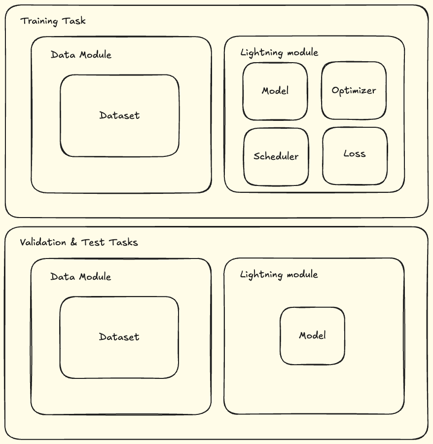
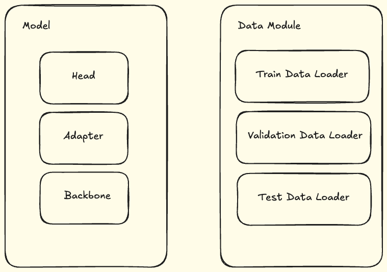
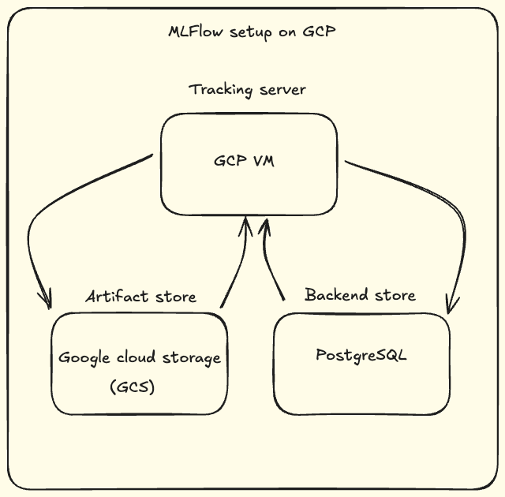
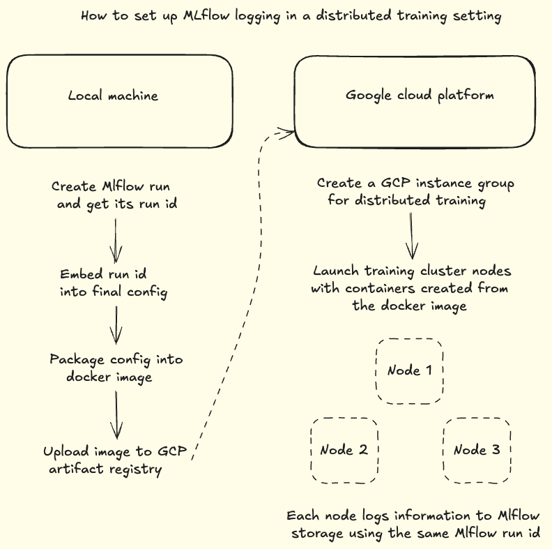
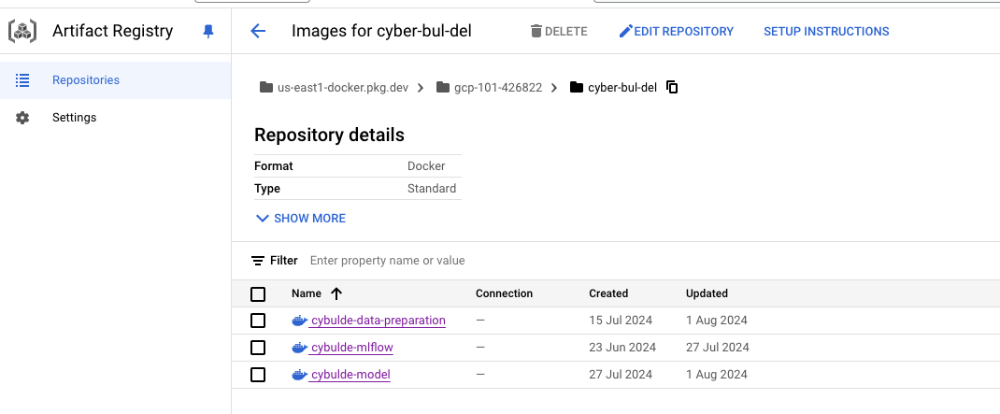
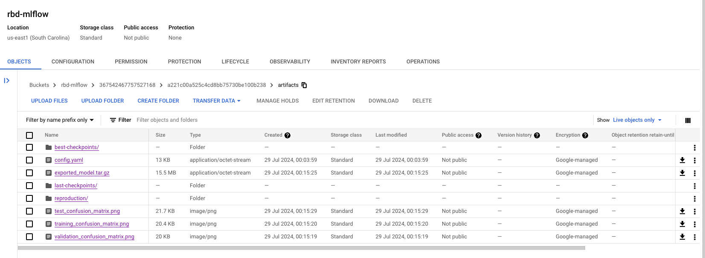
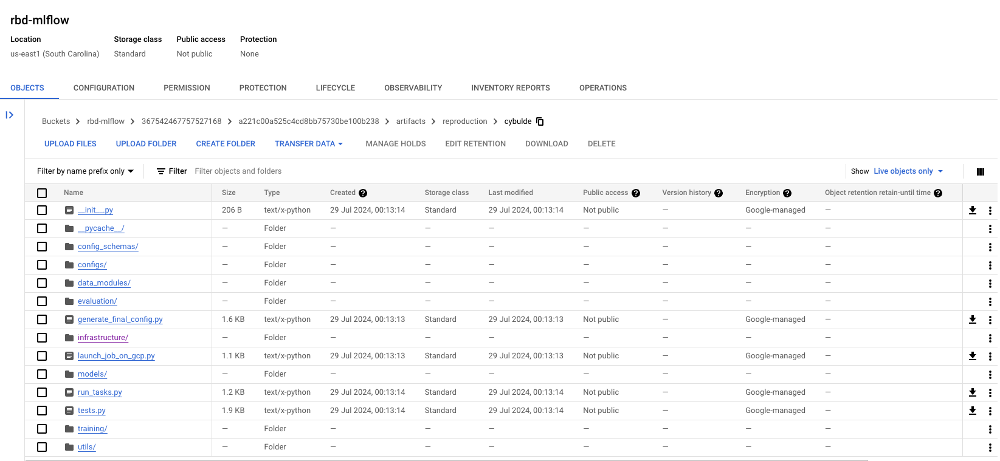
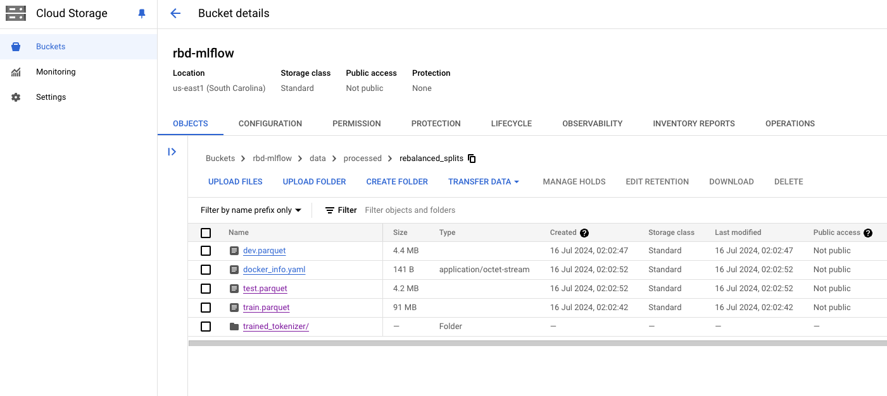
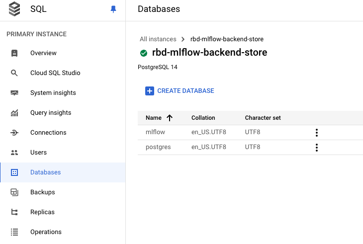

# Cyberbullying Detection

## 📚 Project Overview
This project is focused on developing a deep learning model to detect and classify hate speech, toxic comments, and cyberbullying content on online platforms. The key goal is to create a robust, scalable, and reproducible MLOps pipeline for building and serving deep learning projects to the cloud.

*Note: The objective of this project is to design and implement an MLOps pipeline on the cloud, tailored for a deep learning application. While the current text classification model—a fine-tuned BERT-based model—serves as a foundational example, it is acknowledged that this may not be the most optimal solution for the problem at hand. However, the developed infrastructure is fully capable of supporting more advanced and high-performing models. This infrastructure is not only directly applicable to building better models but also serves as a versatile template for developing and deploying a wide range of deep learning applications.*

🛠️ Ensuring Reproducibility and Maintainability
- **Docker Containerization**: Packages the project, including dependencies, into a Docker container for consistent cross-platform deployment.
- **Data Version Control with DVC**: Manages dataset changes with DVC, enabling reproducible experiments and seamless model retraining.
- **Distributed Data Processing with Dask**: Uses Dask for efficient, scalable data preprocessing and feature engineering.
- **Distributed Model Training with PyTorch**: Accelerates training with PyTorch's distributed capabilities, utilizing multiple GPUs or CPU cores.
- **Cloud-based Infrastructure**: Deployed on Google Cloud Platform (GCP), utilizing its scalable infrastructure, secure storage, Docker management, and Mlflow for model tracking.
- **Configuration Management with Hydra**: Employs Hydra-core for streamlined configuration management and enhanced reproducibility.

The project is divided into four parts(each in its own repo):
- Part 1: [Data collection and versioning]()
- Part 2: [Distributed data processing]()
- Part 3: [Distributed model training and evaluation]()
- Part 4: [Deployment and web app]()

This repository includes code for Part 3 only. 

---

# Part 3:
In Part 2, the raw datasets were preprocessed in a distributed fashion utilizing Dask Distributed, and a custom tokenizer was constructed with Hugging Face Tokenizers. Part 3 encompasses distributed model training and evaluation, along with model tracking via MLflow.

## Key Tools and Technologies
- **GCP instances and instance groups**: Used for the deployment of training cluster and also for tracking mlflow runs. 
- **PyTorch Lightning**: High-level framework built on PyTorch that simplifies the process of training deep learning models. Key features include modular design for clean code, automatic GPU/TPU scaling, built-in logging support, easy early stopping and checkpointing, out-of-the-box distributed training.
- **Mlflow**: Used for tracking/logging training and eval performance, predictions, metrics, parameters, model checkpoints, code, configs, dataset versions & transformation details. 
- **GCP artifact registry**: To store docker images 
- **GCP PostgreSQL (serverless service)**: This is part of the MLflow setup and it serves as a backend store for storing mlflow entities such as runs, parameters, metrics, tags, notes, metadata etc. 
- **GCS bucket**: For retrieving preprocessed datasets. It also serves as mlflow artifact store for storing artifacts such as files, models, images, in-memory objects, model summary etc.

## Model organization overview
- The figure below shows how the training, valoidation and test tasks are organized. Data module holds info about train, validation and test datasets. Lightning module contains code for training, validating and testing the model. 
- Testing and validation tasks have a simpler lightning modules(Pytorch lightning code) because we only require the trained model for generating testing and validation predictions.

  

- Model and the data module blocks mentioned above contain the the following components. 
- Model block contains three components:
  - 1) Backbone - a BERT style backbone which will be the core part of our model
  - 2) Adapter - an optional component used to tranform the output from the backbone into a suitable dimension/distribution
  - 3) Head - Used to generate final prediction outputs. Ex: Softmax, sigmoid etc

  

## Distributed training setup
- Mlflow can be setup in many different ways depending on the architecture of the project. For deploying a project on cloud the setup below is the recommended approach as per MLflow docs.(explanation below is from Mlflow docs) 
- To record all runs’ MLflow entities, the MLflow client interacts with the tracking server via a series of REST requests:
  - 1a and 1b: The MLflow client creates an instance of a RestStore and sends REST API requests to log MLflow entities. The Tracking Server creates an instance of an SQLAlchemyStore and connects to the remote host to insert MLflow entities in the database

- For artifact logging, the MLflow client interacts with the remote Tracking Server and artifact storage host:
  - 2a, 2b, and 2c: The MLflow client uses RestStore to send a REST request to fetch the artifact store URI location from the Tracking Server. The Tracking Server responds with an artifact store URI location (an S3 storage URI in this case). The MLflow client creates an instance of an S3ArtifactRepository, connects to the remote AWS host using the boto client libraries, and uploads the artifacts to the S3 bucket URI location.

  

- How is this applied in the project?
  - Tracking server is a GCP VM 
  - PostgreSQL on GCP is used as a backend store for storing Mlflow entities(runs, parameters, metrics, tags, notes, metadata etc.)
  - Instead using AWS S3 for storing Mlflow entities, GCS bucket is used (files, models, images, in-memory objects, model summary etc.)

  

- Distributed training is conducted on a GCP cluster. How does each cluster node log details to the same MLflow run?
  - In brief, the MLflow run ID should be included in the configuration file.
  - This configuration file is embedded within the Docker image. When the GCP cluster is set up for distributed training, any cluster node created from this image will have the MLflow run ID, ensuring that all nodes log training information to the exact same MLflow run. 

  

## Reference screenshots from the project
- Docker images stored in artifact registry

  

- Mlflow artifacts stored in GCS

  

- MLflow code and config in GCS

  

- Preprocessed data in GCS bucket

  

- Mlfow backend store with PostgreSQL in GCS

  

